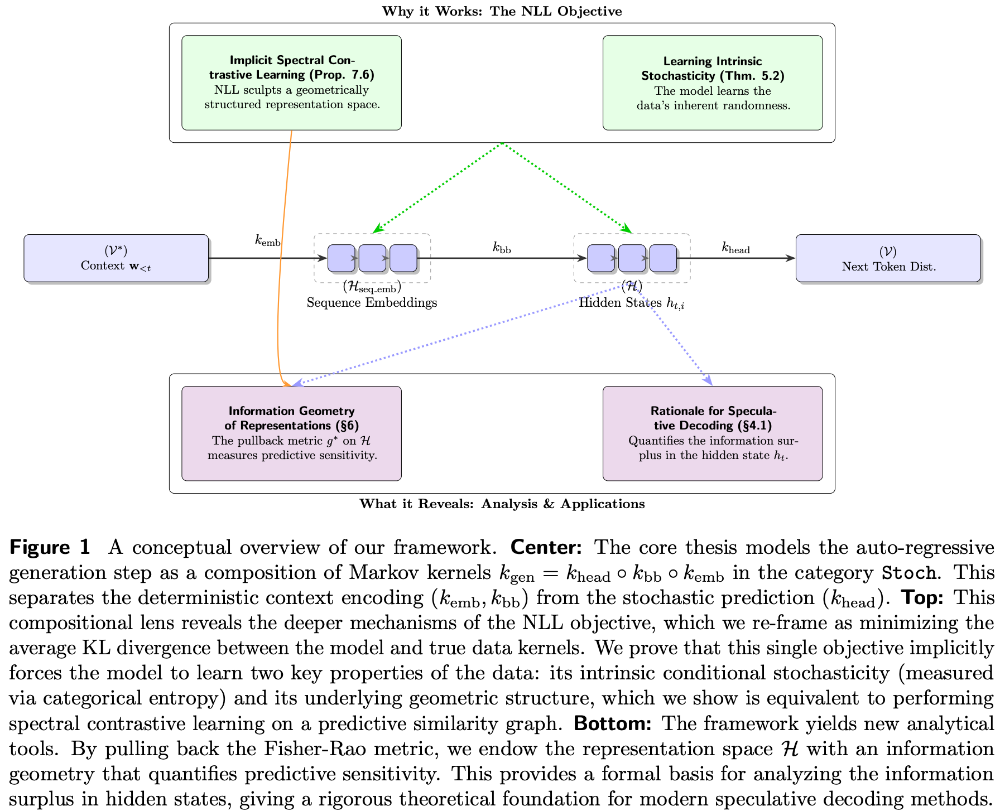

# A Markov Categorical Framework for Language Modeling

[](https://arxiv.org/abs/2507.19247) 
[](https://github.com/yifanzhang-pro/lm-theory) 
[](https://opensource.org/license/apache-2-0) 

## Abstract
Auto-regressive language models are incredibly powerful, yet a deep theoretical understanding of *why* the simple negative log-likelihood (NLL) objective works so well remains elusive. This work introduces a unifying framework using **Markov Categories** to deconstruct the generation process and the NLL objective. We model the single-step generation map as a composition of Markov kernels, which allows us to precisely analyze information flow and the geometry of the learned representation space. Our core finding is that **NLL training is an implicit form of spectral contrastive learning**: it forces the model's representation space to align with the eigenspectrum of a predictive similarity operator, learning a geometrically structured space without explicit contrastive pairs. This perspective reveals the deep structural principles underlying the effectiveness of modern LMs.

## Conceptual Overview

The core of our paper is a new way to view the auto-regressive generation process. We model it as a sequence of probabilistic maps (Markov kernels), which allows us to precisely track how information is transformed and what geometric structures are learned.

<p align="center">
  
</p>

> **A conceptual overview of our framework.** **Center:** The AR generation step is modeled as a composition of Markov kernels _k_<sub>gen</sub> = _k_<sub>head</sub> ∘ _k_<sub>bb</sub> ∘ _k_<sub>emb</sub>. **Top:** This view reveals that the NLL objective implicitly forces the model to learn the data's intrinsic stochasticity and its underlying geometric structure, a process we prove is equivalent to spectral contrastive learning. **Bottom:** The framework provides new analytical tools, such as endowing the representation space ℋ with an information geometry that explains the success of modern speculative decoding methods.

---

## Citation 

If you find our work useful in your research, please consider citing our paper.

```bibtex
@article{zhang2025markov,
  title={A Markov Categorical Framework for Language Modeling},
  author={Zhang, Yifan},
  journal={arXiv preprint arXiv:2507.19247},
  year={2025}
}
```
